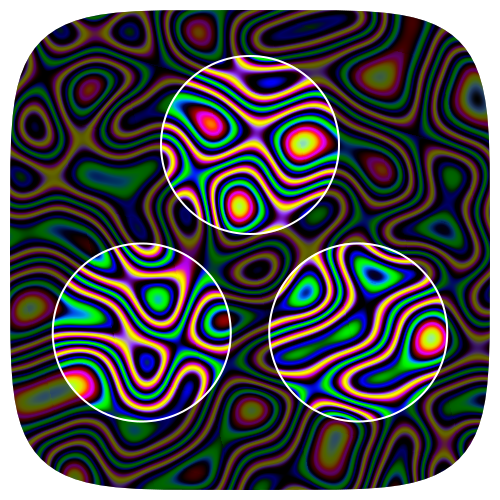

## [User Creations](@id user_creations)

Please feel free to submit a pull request or issue with your creations to be added
to this section. You can use the example markup in the [Tutorial](@ref first_steps) file to
dynamically generate your images.

### A simple logo



```julia
# contributed by cormullion
import CoherentNoise
using Luxor
using ColorSchemeTools

# make a groovy colorscheme
ripple7(n) = sin(π * 7n)
ripple13(n) = sin(π * 13n)
ripple17(n) = sin(π * 27n) 
scheme = make_colorscheme(ripple7, ripple13, ripple17, length=100)

# make noise image
sampler = CoherentNoise.opensimplex_2d(seed=3)
M =  Luxor.Colors.ARGB32.(
    CoherentNoise.gen_image(sampler, 
        w=500, h=500, 
        xbounds=(-4.0, 4.0), 
        ybounds=(-4.0, 4.0),
        colorscheme=scheme))

Drawing(500, 500, "logo.png")
origin()
squircle(O, 240, 240, rt=0.4, action=:clip)
background("black")

# place M
placeimage(M, centered=true, O, alpha=0.4)

# place clipped version
@layer begin
    for pt in ngon(O + (0, 20), 125, 3, π / 6, vertices=true)
        circle(pt, 90, action=:path)
        newsubpath()
    end
    p = storepath()
    clip()
    placeimage(M, centered=true, O)
    setline(4)
    sethue("white")
    drawpath(p, action=:stroke)
end

finish()
preview()
```

